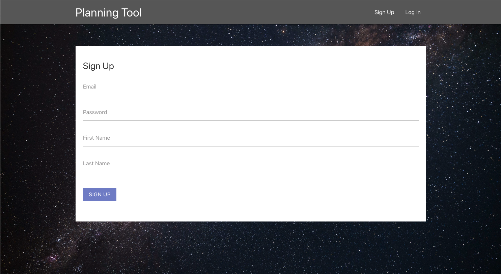
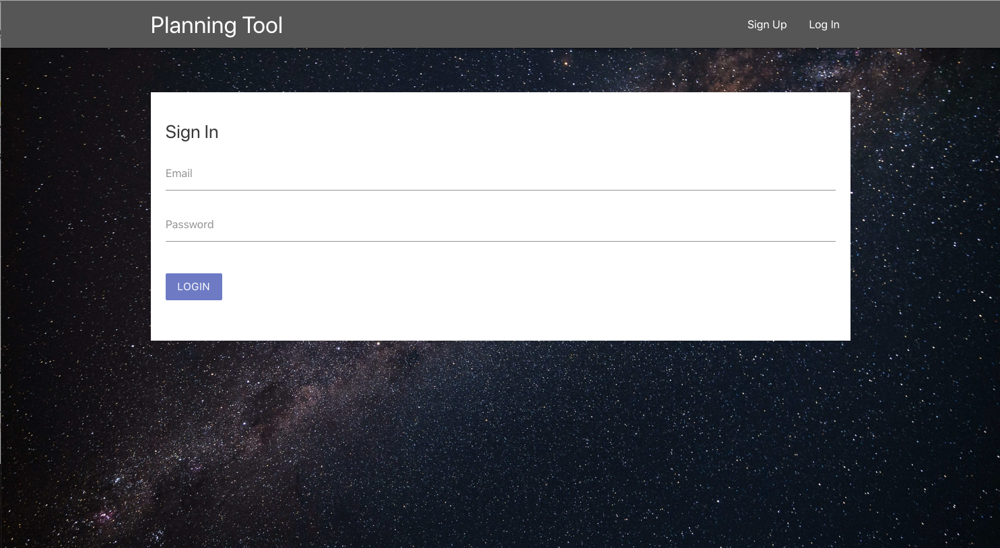
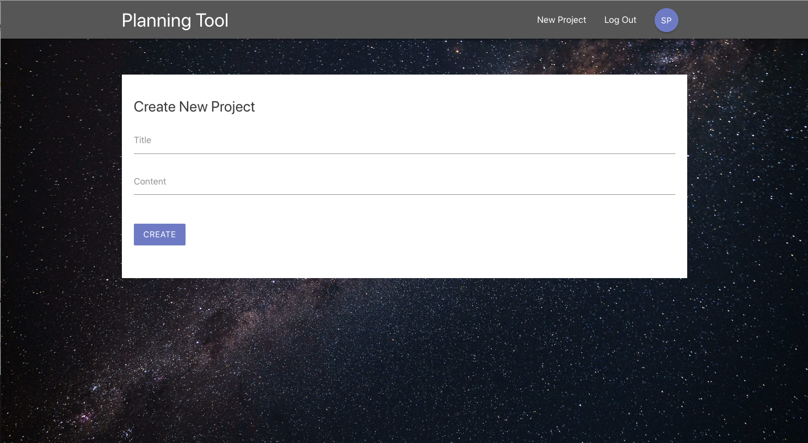
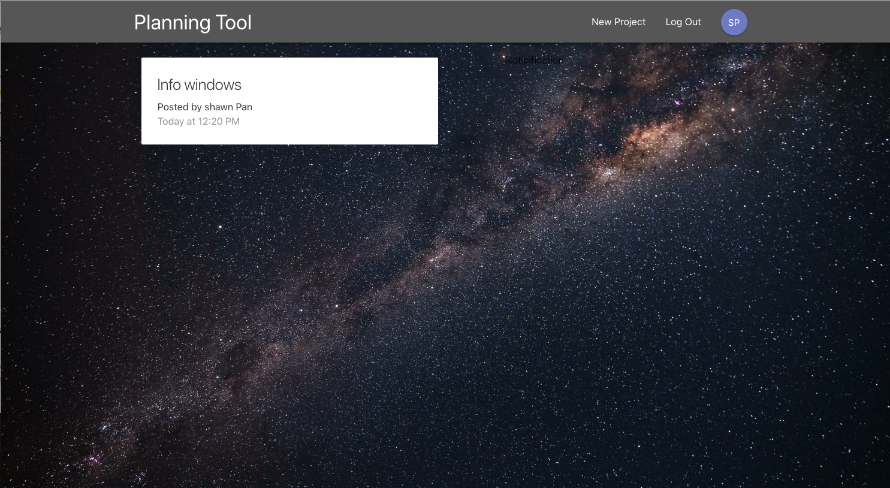

This is a project inspired by [the Net Ninja](https://youtu.be/CkePdocytWM)

A React project mixed with Redux and Firebase.

## Screen shot

## Functions

  - Sign up and Sign in
  - Create project 
  - firebase setup and connect with security

## Available Scripts

In the project directory, you can run:

### `npm install`

Install all packages for this app.

### `npm start`

Runs the app in the development mode. 
Open [http://localhost:3000](http://localhost:3000) to view it in the browser.

The page will reload if you make edits. 
You will also see any lint errors in the console.

